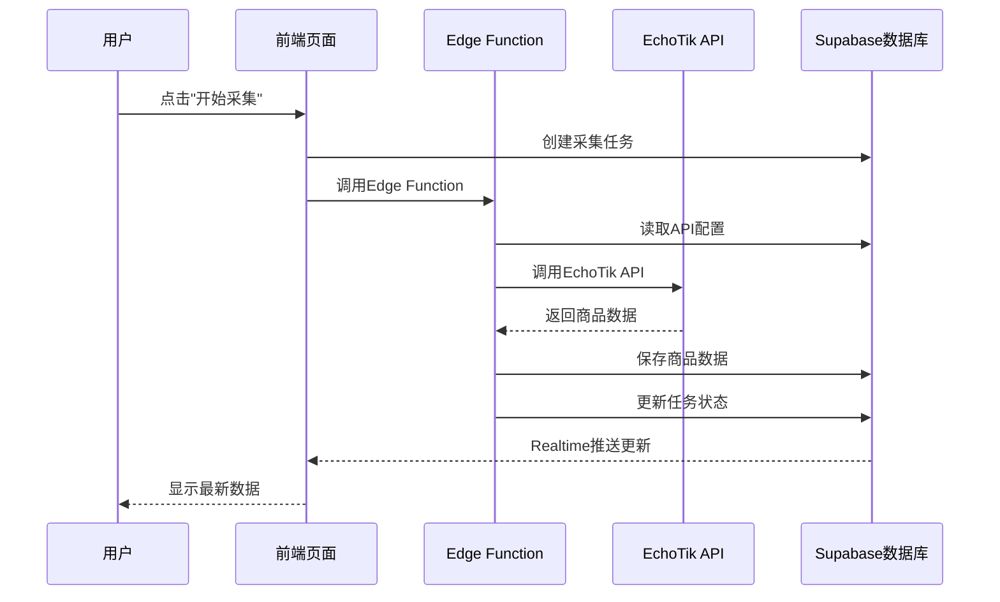
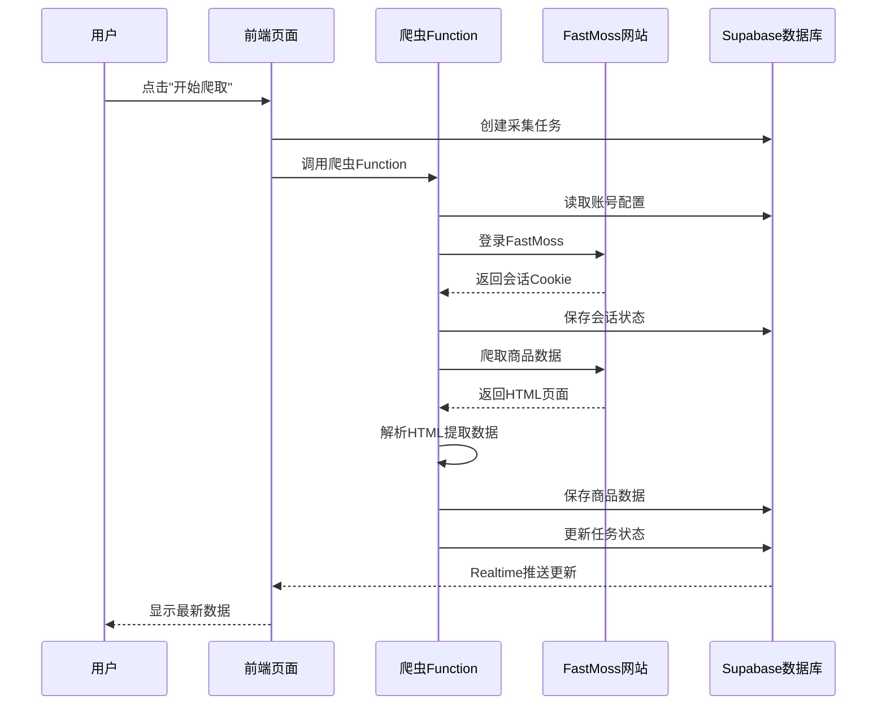

# 🚀 EchoTik & FastMoss API接入指南

## 📋 系统概述

本系统已完整集成EchoTik和FastMoss两个TikTok数据平台的API，实现自动化数据采集和展示功能。

## ✅ 已完成功能

### 1. 数据库架构
- ✅ `tiktok_products` - 商品数据表
- ✅ `tiktok_market_data` - 市场数据表
- ✅ `tiktok_api_configs` - API配置表
- ✅ `tiktok_collection_tasks` - 采集任务表
- ✅ 实时数据同步（Supabase Realtime）

### 2. API配置页面 (`/data-collection`)
- ✅ EchoTik API密钥配置
- ✅ FastMoss API密钥配置
- ✅ 密钥安全存储
- ✅ 采集任务创建和管理
- ✅ 实时任务状态监控
- ✅ 进度显示和错误处理

### 3. Edge Function (`collect-tiktok-data`)
- ✅ 异步数据采集
- ✅ 数据转换和存储
- ✅ 任务状态更新
- ✅ 错误捕获和记录
- ✅ 模拟数据生成（开发测试）

### 4. 主页展示 (`/`)
- ✅ 实时统计数据
- ✅ 最新商品展示
- ✅ 数据来源标识（EchoTik/FastMoss）
- ✅ 自动刷新（Realtime监听）
- ✅ 空状态提示

## 🔑 如何配置账号

### 步骤1：获取账号信息

#### EchoTik (免费账号 - API方式)
1. 访问 [EchoTik官网](https://www.echotik.live/)
2. 注册免费账号
3. 进入 Dashboard > API Keys
4. 生成新的API密钥
5. 复制密钥（格式类似：`ek_live_xxxxxxxxxxxxx`）

#### FastMoss (标准账号 - 爬虫方式)
⚠️ **重要**: FastMoss不提供公开API，需使用账号登录+爬虫方式采集

1. 访问 [FastMoss官网](https://www.fastmoss.com/)
2. 注册标准账号（付费账号有更多数据权限）
3. 记录您的登录用户名/邮箱和密码
4. 确保账号有访问TikTok Shop数据的权限

### 步骤2：配置账号

1. 在应用中进入 **数据采集** 页面 (`/data-collection`)
2. 切换到 **API配置** 标签

**EchoTik配置**:
- 在"EchoTik API"卡片中输入API密钥
- 点击保存按钮

**FastMoss配置**:
- 在"FastMoss爬虫"卡片中输入用户名/邮箱
- 输入密码
- 点击"保存账号配置"按钮

3. 看到 **已配置** 或 **账号已配置** 提示即表示成功

### 步骤3：开始数据采集

1. 确保账号已配置
2. **EchoTik**: 点击"开始采集数据"按钮
3. **FastMoss**: 点击"开始爬取数据"按钮
4. 系统将自动创建采集任务
5. 切换到 **采集任务** 标签查看进度
6. 采集完成后，数据将自动显示在主页

## 📊 数据采集流程

### EchoTik (API方式)


### FastMoss (爬虫方式)


## 🔄 实时数据同步

系统使用Supabase Realtime实现自动数据同步：

### 主页 (`/`)
- 监听 `tiktok_products` 表变化
- 新商品采集后自动显示
- 统计数据实时更新

### 数据采集页 (`/data-collection`)
- 监听 `tiktok_collection_tasks` 表变化
- 任务状态实时更新
- 进度条自动刷新

## 💾 数据存储结构

### 商品数据 (`tiktok_products`)
```typescript
{
  id: UUID,
  product_id: string,        // 唯一标识
  name: string,              // 商品名称
  price: {
    value: number,
    currency: string,
    originalPrice: number,
    discount: number
  },
  sales: {
    total: number,
    daily: number,
    weekly: number,
    monthly: number
  },
  growth: {
    rate: number,
    trend: 'up' | 'down' | 'stable'
  },
  countries: ['VN', 'TH', 'MY', 'SG'],
  data_source: 'echotik' | 'fastmoss',
  // ... 更多字段
}
```

## 🎯 成本控制

### 免费额度内使用
- **Supabase**: 免费套餐500MB数据库
- **EchoTik**: 免费账号每日1000次请求
- **FastMoss**: 标准账号有配额限制

### 优化建议
1. **定时采集**: 不要频繁采集，建议每天1-2次
2. **增量更新**: 只采集新增和更新的商品
3. **数据清理**: 定期删除过期数据
4. **缓存策略**: 前端缓存商品列表

## 🛠 开发模式

### EchoTik API模式
当前运行在**模拟模式**，生成测试数据。切换到真实API需编辑：
`supabase/functions/collect-tiktok-data/index.ts`

### FastMoss爬虫模式
当前运行在**模拟模式**，生成测试数据。切换到真实爬虫需编辑：
`supabase/functions/fastmoss-scraper/index.ts`

实现要点：
1. **登录逻辑**: 实现真实的FastMoss登录流程
2. **HTML解析**: 使用DOMParser解析页面提取数据
3. **会话管理**: 保存和复用登录会话
4. **反爬策略**: 
   - 随机延迟请求（500-2000ms）
   - 设置真实的User-Agent
   - 限制并发数（建议3-5个）
   - 定期轮换IP（如需要）

### 切换到真实爬虫

编辑 `supabase/functions/fastmoss-scraper/index.ts`:

```typescript
// 1. 实现真实登录
async function loginFastMoss(username: string, password: string) {
  const response = await fetch('https://www.fastmoss.com/api/auth/login', {
    method: 'POST',
    headers: {
      'Content-Type': 'application/json',
      'User-Agent': 'Mozilla/5.0 (Windows NT 10.0; Win64; x64) AppleWebKit/537.36',
    },
    body: JSON.stringify({ username, password }),
  });

  if (!response.ok) {
    throw new Error('登录失败');
  }

  const data = await response.json();
  const cookies = response.headers.get('set-cookie');
  
  return {
    token: data.token,
    cookies: parseCookies(cookies),
  };
}

// 2. 实现真实数据爬取
async function scrapeProducts(session: any, countries: string[]) {
  const products = [];
  
  for (const country of countries) {
    const response = await fetch(
      `https://www.fastmoss.com/products?country=${country}&limit=50`,
      {
        headers: {
          'Cookie': formatCookies(session.cookies),
          'Authorization': `Bearer ${session.token}`,
          'User-Agent': 'Mozilla/5.0 (Windows NT 10.0; Win64; x64) AppleWebKit/537.36',
        },
      }
    );
    
    const html = await response.text();
    const dom = new DOMParser().parseFromString(html, 'text/html');
    
    // 根据FastMoss实际页面结构调整选择器
    const productElements = dom.querySelectorAll('.product-card');
    
    for (const element of productElements) {
      const product = {
        product_id: element.getAttribute('data-product-id') || '',
        name: element.querySelector('.product-title')?.textContent?.trim() || '',
        price: parsePrice(element.querySelector('.product-price')?.textContent),
        // ... 更多字段
      };
      
      products.push(product);
    }
    
    // 随机延迟，避免被检测为爬虫
    await randomDelay(500, 2000);
  }
  
  return products;
}

function randomDelay(min: number, max: number) {
  const delay = Math.floor(Math.random() * (max - min + 1)) + min;
  return new Promise(resolve => setTimeout(resolve, delay));
}
```

## 📝 API文档参考

### EchoTik API
- **方式**: RESTful API
- **文档**: https://www.echotik.live/blog/tiktok-data-api-access-endpoints-analytics-best-practices/
- **端点**: `https://api.echotik.com/v1/`
- **认证**: Bearer Token
- **限制**: 免费账号每日1000次请求

### FastMoss 爬虫
- **方式**: 网页爬虫
- **网站**: https://www.fastmoss.com/
- **要求**: 标准账号登录
- **数据**: TikTok Shop商品、销量、趋势等
- **注意事项**:
  - 需遵守网站ToS
  - 建议使用代理IP
  - 控制请求频率
  - 保存会话状态以减少登录次数

## 🔐 安全性

✅ **API密钥加密存储** - 存储在Supabase数据库  
✅ **后端调用** - API调用在Edge Function中执行  
✅ **CORS保护** - 只允许授权域名访问  
✅ **RLS策略** - 行级安全保护数据

## 🐛 故障排查

### 问题：API密钥保存失败
**解决**: 检查密钥格式是否正确，确保没有多余空格

### 问题：采集任务一直显示"运行中"
**解决**: 检查Edge Function日志，可能是API配额耗尽或网络问题

### 问题：商品数据不显示
**解决**: 
1. 确认采集任务已完成
2. 检查浏览器控制台错误
3. 刷新页面重新加载数据

## 📞 支持

如遇问题请检查：
- Supabase控制台 > Logs
- Edge Functions日志
- 浏览器开发者工具

---

**系统状态**: ✅ 已完成并可用  
**最后更新**: 2026-01-18
